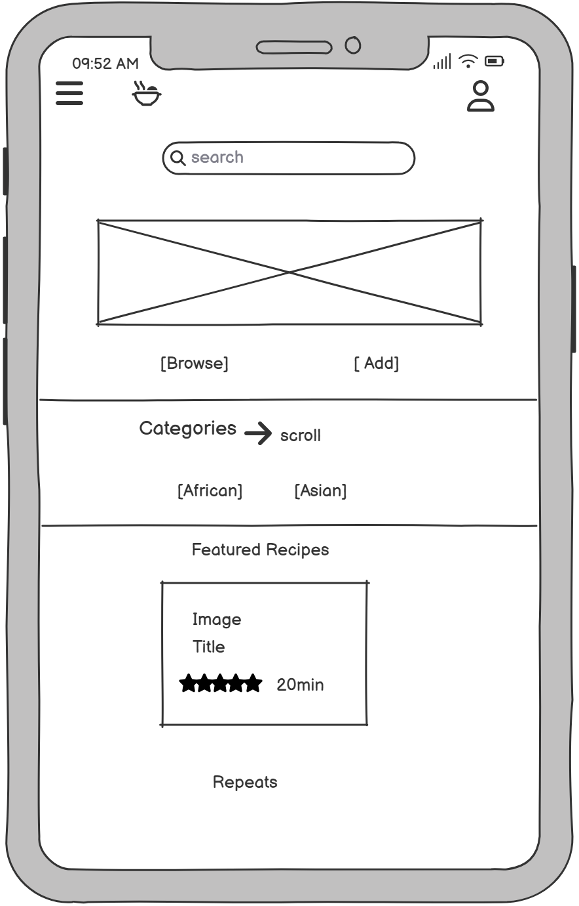
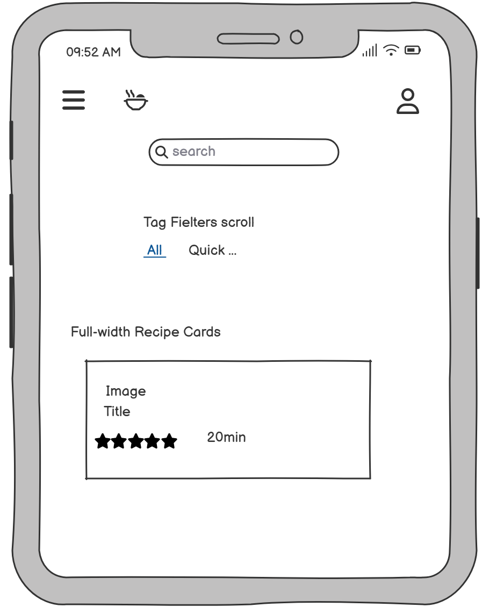
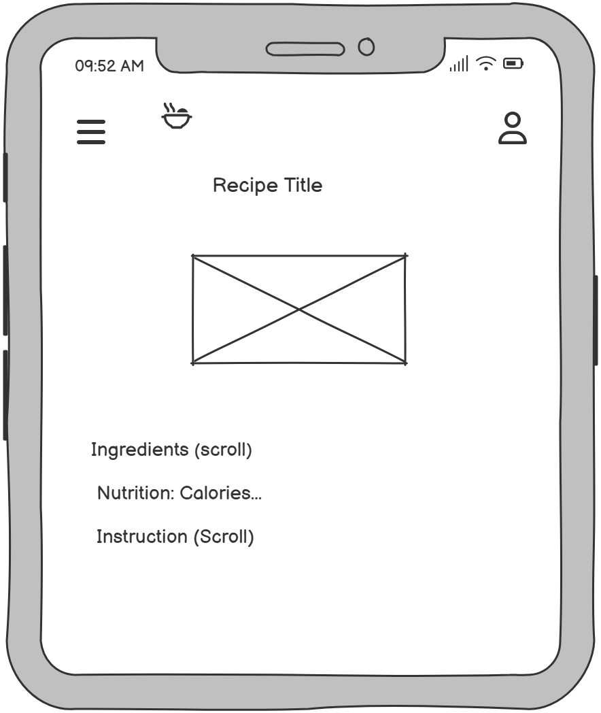
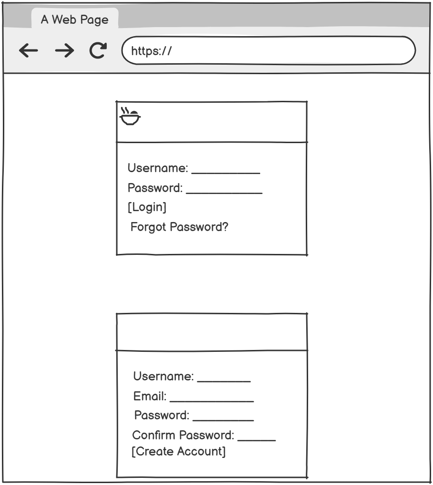
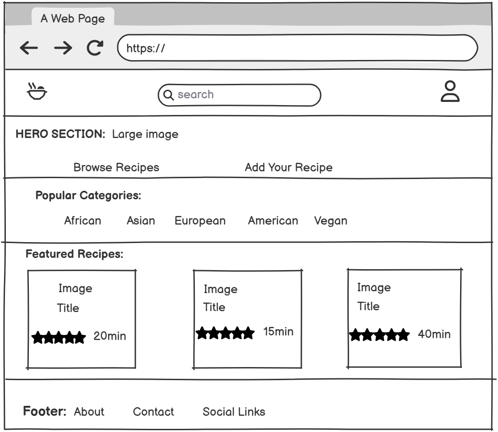
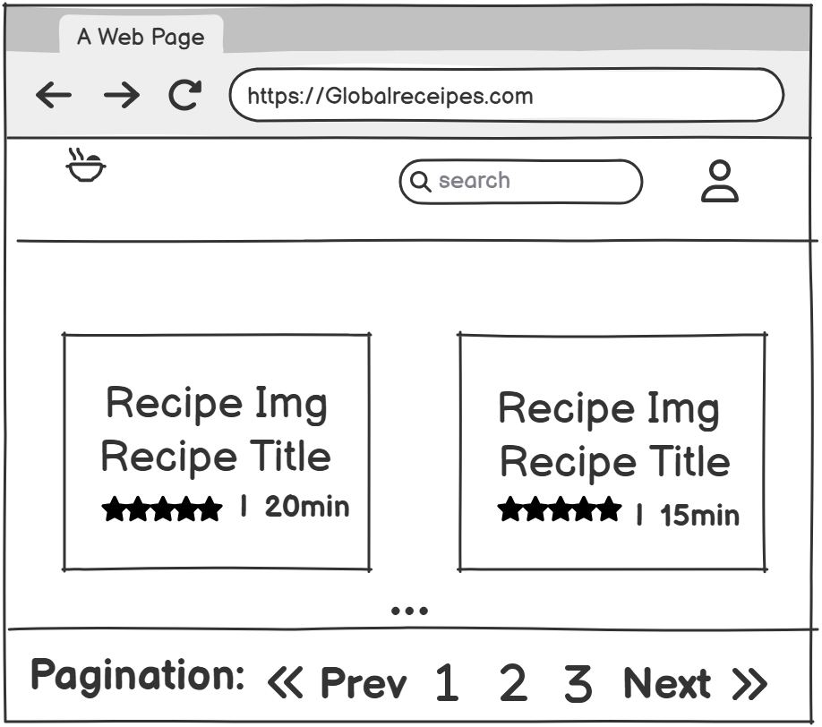
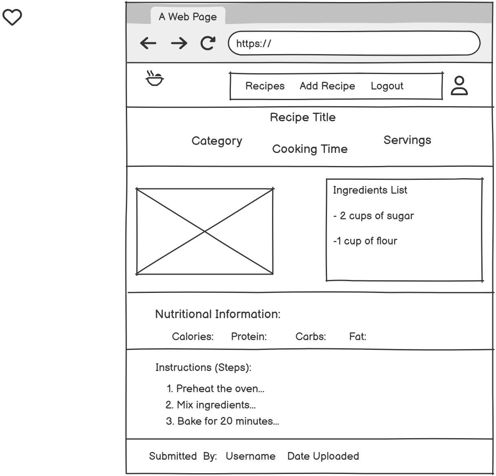
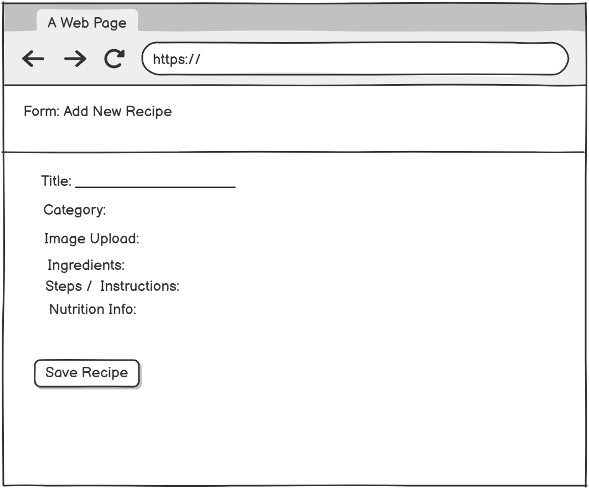

#  Global Recipe

GlobalRecipe is a full-stack Django web application that allows users to browse, search, and manage recipes from different cuisines around the world. The project demonstrates full CRUD functionality, user authentication, media handling, and deployment to a live production environment.

The application is designed with usability, accessibility, and performance in mind and has been successfully deployed to Heroku.


---

## Contents
- [User Goals](#user-goals)
- [User Stories](#user-stories)
- [Website Goals and Objectives](#website-goals-and-objectives)
- [Wireframes](#wireframes)
- [Design Choices](#design-choices)
  - [Typography](#typography)
  - [Colour Scheme](#colour-scheme)
  - [Media](#media)
  - [Responsiveness](#responsiveness)
- [Features](#features)
  - [Existing Features](#existing-features)
  - [Future Enhancements](#future-enhancements)
- [Data Model](#data-model)
  - [Entity Relationship Diagram](#entity-relationship-diagram)
- [Technologies Used](#technologies-used)
  - [Languages](#languages)
  - [Libraries & Framework](#libraries--framework)
  - [Tools](#tools)
- [Testing](#testing)
  - [Code Validation](#code-validation)
  - [Feature Testing](#feature-testing)
  - [Accessibility Testing](#accessibility-testing)
  - [Bugs Fixed](#bugs-fixed)
- [Deployment](#deployment)
  - [To deploy the project](#to-deploy-the-project)
  - [To fork the project](#to-fork-the-project)
  - [To clone the project](#to-clone-the-project)
- [Security & Environment Variables](#security--environment-variables)
- [Credits](#credits)

---

## User Goals
- Quickly discover recipes by name, tags, or ingredients.
- View clear ingredient lists and step-by-step instructions.
- Submit personal recipes with images.
- Edit or delete recipes they own.
- Save time with a clean, mobile-first interface.

## User Stories
**As a visitor**
- I can browse all recipes so that I can find something to cook.
- I can search/filter so that I can narrow results quickly.
- I can view a recipe’s details so that I can follow steps easily.

**As a registered user**
- I can add a recipe so that I can share it with others.
- I can edit or delete my own recipes so that I can keep them up-to-date.
- I can see my submitted recipes in one place.

**As an admin**
- I can manage users and recipes via Django Admin so that I can moderate content.

---

## Website Goals and Objectives
- Provide full CRUD (Create, Read, Update, Delete) functionality for recipes backed by a relational database.
- Meet accessibility guidelines (semantic HTML, ARIA where appropriate, colour contrast).
- Use clean project structure, version control, and professional documentation.
- Deploy to a cloud platform with DEBUG off and secrets protected.

---

## Wireframes

### Mobile Screens





### Desktop Screens





---

## Design Choices

### Typography
- Headings: **Inter** (or Bootstrap default system UI stack).  
- Body: **System UI** for performance and readability.

### Colour Scheme
- Primary: `#198754` (Bootstrap “success” tone)  
- Secondary: `#0d6efd`  
- Background: `#ffffff`  
- Text: `#212529` 

### Media
- Recipe images uploaded by users. Images are validated for type/size and stored in `/media/recipes/`.

### Responsiveness
- Built with Bootstrap’s grid/utilities.  
- All pages tested at common breakpoints: 320px, 768px, 1024px, 1440px.

---

## Features

### Existing Features
- Home page with recent recipes and call-to-actions.
- Recipes list with pagination and basic search (title/tags).
- Recipe detail page with ingredients, steps, cooking time, and image.
- Authenticated users can **create**, **update**, and **delete** their own recipes.
- Full CRUD for recipes (Create, Read, Update, Delete).
- Django Admin configured with inlines for quick ingredient/step entry.
- Flash messages for user feedback (create/update/delete success).
- 404/500 user-friendly error pages (optional).

### Future Enhancements
- User favourites / ratings.
- Advanced filters (cuisine, dietary requirements).
- Image optimization (thumbnails).
- Comments and moderation workflow.
- API endpoints for mobile consumption.

---

## Data Model
The core entities are **Recipe**, **Ingredient**, and **Step** with `User` as author.

- **Recipe**
  - `title`, `description`, `image`, `author(FK User)`, `tags`, `cooking_time`, `created_at`
- **Ingredient**
  - `recipe(FK)`, `name`, `quantity`
- **Step**
  - `recipe(FK)`, `order`, `instruction` (ordered by `order`)

### Entity Relationship Diagram

- A User can create many Recipes.
- A Recipe belongs to one User (author).
- A Recipe has many Ingredients.
- A Recipe has many Steps.
- Ingredients and Steps cannot exist without a Recipe.

These relationships are implemented using Django ForeignKey relationships.

## Technologies Used

### Frontend
- HTML5
- CSS3
- Bootstrap
- JavaScript (minimal)

### Backend
- Python
- Django 5

### Database
- SQLite (local development)
- PostgreSQL (production)

### Deployment & Services
- Heroku
- Cloudinary (production media storage)
- Gunicorn

### Tools
- Git & GitHub
- VS Code
- Google Lighthouse

---


### Feature Testing

### Accessibility Testing

### Bugs Fixed


## Version Control

Git was used for version control throughout development.
The project repository is hosted on GitHub and includes regular commits documenting feature development, bug fixes, and refactoring.

---


## Deployment


The application was deployed using **Heroku** with the following considerations:

- Environment variables used for security (SECRET_KEY, DATABASE_URL, CLOUDINARY_URL)
- PostgreSQL database configured via Heroku
- Cloudinary used for media storage in production
- Static files collected and served correctly
- DEBUG disabled in production

---

##  Performance & Accessibility

The live application was tested using **Google Lighthouse** on the deployed site.

### Lighthouse Results:
- **Performance:** 100
- **Accessibility:** 89
- **Best Practices:** 74
- **SEO:** 91

These results demonstrate strong performance optimisation, good accessibility practices, and effective SEO implementation.

### To deploy the project (Heroku)
1. Create a new Heroku app.
2. In Heroku Settings → Config Vars, add:
   - `SECRET_KEY`
   - `DATABASE_URL` (added automatically if you attach Heroku Postgres)
   - `CLOUDINARY_URL` (if used)
3. In your project, ensure you have:
   - `requirements.txt`
   - `Procfile`
4. Push to GitHub and connect the repo to Heroku (Deploy tab), or deploy via CLI.
5. Run migrations on Heroku:
   ```bash
   heroku run python manage.py migrate


## Security & Environment Variables

All sensitive data is stored securely using environment variables and is not committed to GitHub.

Environment variables used:
- `SECRET_KEY`
- `DATABASE_URL` (production)
- `CLOUDINARY_URL`

A local `.env` file is used during development and is included in `.gitignore`.
On deployment, these are set using the hosting platform Config Vars  Heroku.

## Credits
### Code, libraries and resources
- Django Documentation: https://docs.djangoproject.com/
- Bootstrap Documentation: https://getbootstrap.com/

Any external code snippets (if used) are clearly credited in the code comments above the relevant sections.
All other code, models, views, templates and styling were written by the project author.
